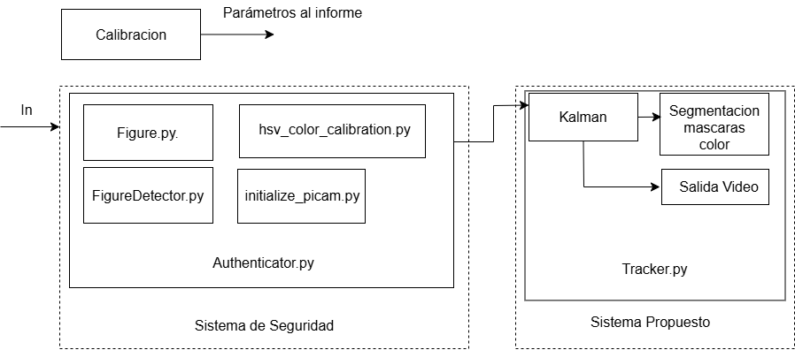

<h1>Final Project on Computer Vision 👁️💻</h1>

## Table of Contents
1. [Introduction](#introduction)
2. [Methodology](#methodology)
  - [Camera Calibration](#camera-calibration)
  - [System Block Diagram](#system-block-diagram)
  - [Image Transformation Sequence](#image-transformation-sequence)
  - [Security System](#security-system)
    - [Pattern Detection](#pattern-detection)
    - [Information Extraction](#information-extraction)
  - [Proposed System](#proposed-system)
    - [Tracker](#tracker)
    - [Extensions](#extensions)
    - [Video Output](#video-output)

## Introduction
This project aims to develop a comprehensive computer vision system that can perform various tasks such as camera calibration, image transformation, and security pattern detection. The system is designed to be robust and extendable, allowing for future enhancements and additional functionalities.

## Methodology
How it is executed:

First, we perform camera calibration to obtain intrinsic and extrinsic parameters using a chessboard. Then, we use the pictures to calibrate the camera. 

In a different module (this part is adapted to run in real-time), the security system has a memorized password pattern. Image by image, it will search to identify any of the figures corresponding to the pattern and finally check if it is correct. If it is, it will launch the tracker; if not, it will ask to re-enter the password.

Finally, the tracker is launched, which manually identifies the cars (it has to be introduced when running) and tracks and predicts them through the image. Additionally, it segments color masks to identify the color of traffic lights as an extension.

### Camera Calibration
We use the function `findChessboardCorners()` to find the corners in the figure and the function `get_calibration_points()` that we designed to get the corners in 3D.

### System Block Diagram
The block diagram visually shows the relationship between the modules and the different functions of the entire project.

### Image Transformation Sequence

The image undergoes different transformations in both processes (security system and proposed system) to achieve our objectives.

1. **Security System:**
  - Blurred Frane ➡️ HSV ➡️ Segmented by Color ➡️ Eroded mask

2. **Proposed System:**
  - HSV ➡️ Segmented by color ➡️ Eroded Mask ➡️ Mask dilated 

### Security System
We can detect polygons with any number of sides and any color. To achieve this, we first determine the exact RGB color of the polygon and the number of vertex.

Then using the file `src/Sistema_de_Seguridad/FigureDetect/detect_shape` we start by applying a Gaussian blur to the image to reduce noise. Next, we segment the image based on the polygon's color by calculating themean of the color in the contour detected and applying a lower and upper bound to the color. To remove small blobs of the color, we erode the image.

With a binarized image containing only the desired shape, we proceed to determine the number of sides. We find the contours of the shape using `cv2.findContours()`, and then approximate the contours with `cv2.approxPolyDP()`, which gives us the number of sides. If all steps are correctly executed, we can identify the polygon by its color and number of sides.

#### Information Extraction
We implement a loop that uses the previously defined pattern detection algorithm to set a password and repeatedly prompts for it until it is entered correctly.

To improve detection accuracy when a figure appears or disappears, we add detected figures in the frame to a queue. 

For the password to be accepted, the sequence must be the same. The first figure must be detected first, followed by the second, and so on. The check is performed only after the entire sequence has been entered. If the password is correct, the image frame will be highlighted in green; if incorrect, it will be highlighted in red.

### Proposed System
#### Tracker
For the tracker, we used the Kalman algorithm because it allows for the correction and prediction of the tracked object while modeling the noise detected in the images. We calculate the back projection by converting the image to HSV and determining the probability that each pixel belongs to the object based on the histogram of the selected object. Then, we use the meanShift algorithm to find the new position of the object based on the back projection.

#### Extensions and conclusions
The code was adapted to identify the color of traffic lights appearing in the image, correctly identifying the colors and thus distinguishing when the car should stop or has the right of way to proceed. Everything works correctly and as expected, although we initially struggled with the pattern detector because we had selected a very laborious one, which we later replaced with the current one. We would have liked to extend the project to determine the distance of the car from the camera, but we did not have enough time to test and implement it. This would have expanded the concept of the autonomous car we designed with this tracker.

#### Video Output
Here is a video demonstrating the final output of our system:

## Authors
- Teresa Garvía Gallego
- Teresa Franco Corzo

